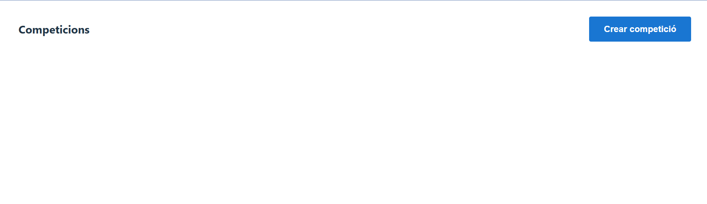

# **Bienvenido a tu gestor de resultados de LaLiga de futbol profesional**

## INTRODUCCIÓN

Como amante del fútbol, siempre me ha fascinado cómo funcionan las aplicaciones de gestión de resultados. Por eso he decidido crear mi propia versión, aunque sea en una fase inicial y con fines educativos.

Con esta aplicación podrás:
- Crear competiciones, temporadas y partidos de forma manual.
- Crear jugadores y asignarlos a cada equipo y temporada.
- Registrar resultados para que la clasificación se actualice automáticamente.

Los criterios de desempate en la clasificación siguen el sistema de LaLiga española. Aunque es posible crear competiciones de otros países, la clasificación siempre usará estos criterios.

## INSTALACIÓN

Para empezar a usar esta aplicación, necesitarás:

- MySQL como gestor de datos
- Python 3.10+ y pip
- Node.js y npm (para el frontend con Vue.js)

---

### 1. Clonar el repositorio

Clonar el repositorio via IDE, o via terminal:
```
git clone https://github.com/.../...(url del repositorio)
cd repo
```

### 2. Instalación de dependencias del Backend

```
cd backend
python -m venv venv
# Activar entorno
# En Linux/Mac:
source venv/bin/activate
# En Windows:
venv\Scripts\activate
```
**Instalar las dependencias**

```
pip install -r requirements.txt
```
**Configurar la conexión a MySQL**

Crea un archivo .env en la raíz del backend

```
MYSQL_HOST=localhost	
MYSQL_USER=your_user	
MYSQL_PASSWORD=your_password
MYSQL_DB=futbol_gestor
MYSQL_PORT=3306	
MYSQL_DB_TEST=futbol_gestor_test
```

### 3. Creación de la base de datos mediante Alembic

Ejecutar en terminal:

```
alembic upgrade head
```
Una vez se ha creado la base de datos y las migraciones ya podemos empezar a correr el backend

### 4. Instalación de paquetes Frontend

Abrir una nueva terminal y acceder a la raíz del frontend

```
cd frontend
npm install
```
Una vez se han instalado los pqauetes del proyecto, ya se puede correr el frontend.

## EJECUCIÓN

Para ejecutar el programa, una vez instaladas todas las dependencias y inicializada la base de datos hay que abrir dos terminales. En una, ir a la raíz del directorio backend y ejecutar
```
uvicorn app.main:app --reload
```
El backend corre en el puerto 8000.

En la otra terminal, ir a la raíz del directorio frontend y ejecutar

```
npm run dev
```
El frontend corre en el puerto 5173 por defecto, aunque para empezar a usar la aplicación, hay que acceder a http://localhost:5173/, o el puerto donde esté corriendo el frontend.

## FUNCIONALIDADES Y GUÍA DE USO

Funcionalidades disponibles:

- Crear competiciones tipo liga regular
- Crear temporadas de cada competición creada
- Crear equipos
- Vincular equipos a temporadas
- Crear jornadas con partidos
- Editar los resultados de los partidos
- Consultar la clasificación por jornada
- Consultar el historial de posiciones de cada equipo en la temporada
- Crear jugadores
- Vincular jugadores a los equipos de cada temporada


**Crear competiciones liga regular**

Para crear una competicion hay que ir a la pantalla principal de la aplicación



Cuando clicas el botón de "Crear competició", se abre un menú para la creación, en él, hay que indicar el nombre y el tipo (actualmente solo soporta el formato "Lliga") como campos obligatorios, y de manera opcional, el país de la competición y un link de una imagen del logo.
