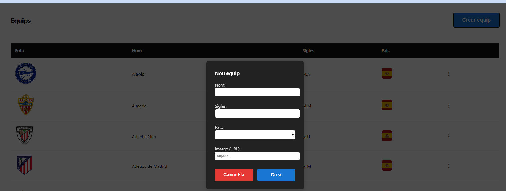
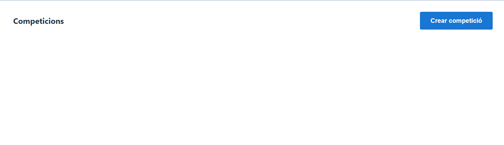
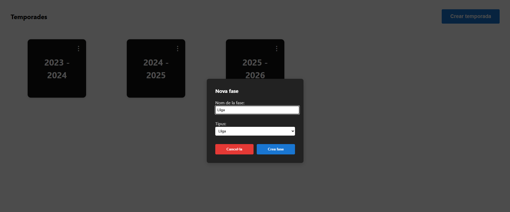
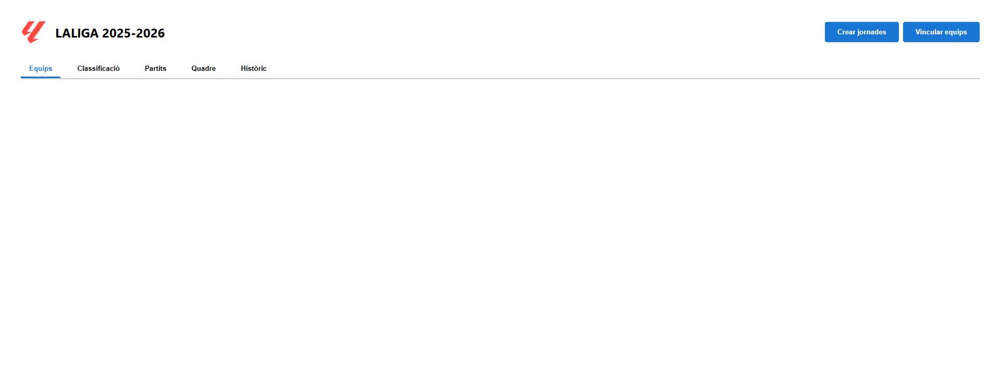
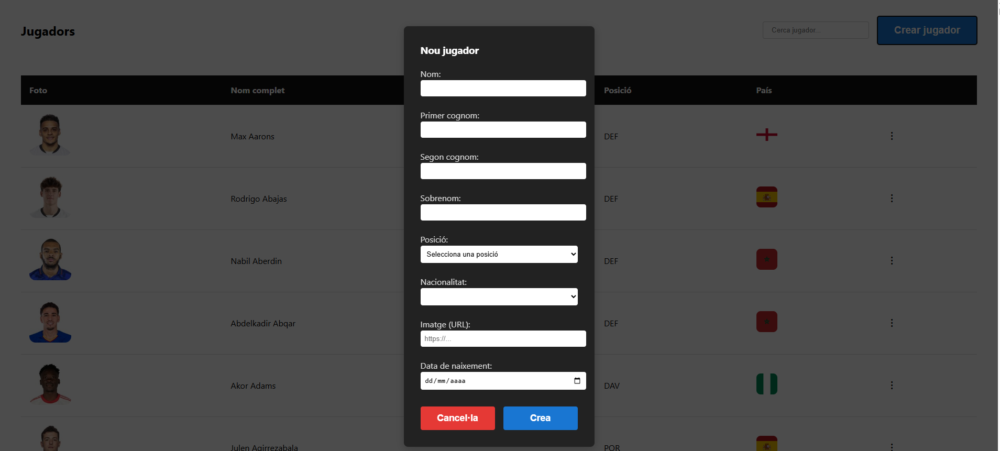

---

# LaLiga Results Manager

## Index

* [Introduction](#introduction)
* [Technologies Used](#technologies-used)
* [Installation](#installation)

  * [1. Clone the Repository](#1-clone-the-repository)
  * [2. Backend](#2-install-backend-dependencies)
  * [3. Database](#3-create-the-database)
  * [4. Frontend](#4-install-frontend-packages)
* [Execution](#execution)
* [Features and Usage Guide](#features-and-usage-guide)
* [Future Features](#future-features)

---

## Introduction

As a football enthusiast, I have always been fascinated by how result management applications work.
This project is an **educational web application** to manage football competitions, results, and standings, following the tiebreaker criteria of [LaLiga](https://www.laliga.com).

With this application, you can:

* Create competitions, seasons, and matches manually.
* Create players and assign them to teams per season.
* Record results and automatically update the standings.

---

## Technologies Used

**Backend**

* [FastAPI](https://fastapi.tiangolo.com/) (Python 3.10+)
* [MySQL](https://www.mysql.com/)
* [Alembic](https://alembic.sqlalchemy.org/) for migrations

**Frontend**

* [Vue.js](https://vuejs.org/)
* [Node.js](https://nodejs.org/) / [npm](https://www.npmjs.com/)

---

## Installation

To start using this application, you will need:

* MySQL as the database manager
* Python 3.10+ and pip
* Node.js and npm (for the frontend with Vue.js)

---

### 1. Clone the Repository

Clone the repository via IDE or terminal:

```
git clone https://github.com/.../...(url del repositorio)
cd repo
```

### 2. Install Backend Dependencies

```
cd backend
python -m venv venv
# Activate environment
# On Linux/Mac:
source venv/bin/activate
# On Windows:
venv\Scripts\activate
```

**Install dependencies**

```
pip install -r requirements.txt
```

**Configure MySQL connection**

Create a `.env` file in the backend root:

```
MYSQL_HOST=localhost	
MYSQL_USER=your_user	
MYSQL_PASSWORD=your_password
MYSQL_DB=futbol_gestor
MYSQL_PORT=3306	
MYSQL_DB_TEST=futbol_gestor_test
```

### 3. Create the Database with Alembic

Run in terminal:

```
alembic upgrade head
```

Once the database and migrations are created, the backend is ready to run.

### 4. Install Frontend Packages

Open a new terminal and go to the frontend root:

```
cd frontend
npm install
```

Once the packages are installed, the frontend can be started.

---

## Execution

To run the program, once all dependencies are installed and the database initialized, open two terminals. In one, go to the backend root and run:

```
uvicorn app.main:app --reload
```

The backend runs on port 8000.

In the other terminal, go to the frontend root and run:

```
npm run dev
```

The frontend runs on port 5173 by default. To use the application, access [http://localhost:5173/](http://localhost:5173/).

---

## Features and Usage Guide

Available features:

* Create teams
* Create league competitions
* Create seasons for each competition
* Link teams to seasons
* Create matchdays with matches
* Edit match results
* View standings by matchday
* View team position history for the season
* Create players
* Link players to teams for each season

---

**Create teams**

Go to the `/equips` view. Click the blue button and enter name, acronym, country, and a logo image link.



**Create league competitions**

Go to the main screen and click "Crear competició". Enter name and type (currently only supports "Lliga"). Optionally, add country and logo URL.



**Create seasons for each competition**

Enter a competition and click to open its view. Click the blue button and enter start year, end year, and number of teams. Then name the competition phase (type: League).




**Link teams to seasons**

In the season view, click the blue button "Vincular equips", select teams from the dropdown, and repeat until all participating teams are linked.



**Create matchdays with matches**

In the same view, click "Crear jornades", select home team, visitor, and matchday. Teams must be linked before creating matches.

**Edit match results**

In the "Partits" tab, navigate matchdays, click "Editar resultats", enter goals for each team, then click "Finalitzar edició" to save.

**View standings and history**

Navigate the tabs in the matches view to see standings and historical positions.

**Create players**

In `/jugadors`, click "Crear jugador". Enter mandatory name, first surname, and position (POR = goalkeeper, DEF = defender, MIG = midfielder, DAV = forward). Optionally, add second surname, nickname, nationality, image URL, and birthdate.



**Link players to teams**

In a specific season, click a team, choose the season to modify, click the blue button, select players via checkboxes, and save.


---

## Future Features

This project is in an early stage. Planned features include:

* Support for postponed or rescheduled matches
* Importing team rosters from previous seasons
* Event manager for matches (lineups, substitutions, goals, assists, cards)
