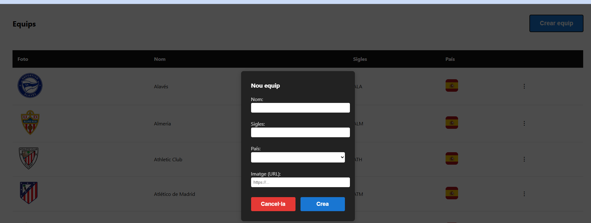
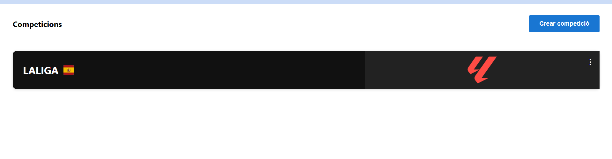
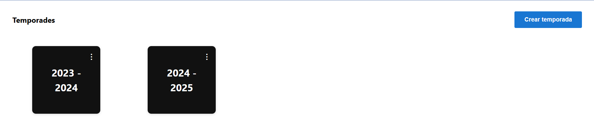
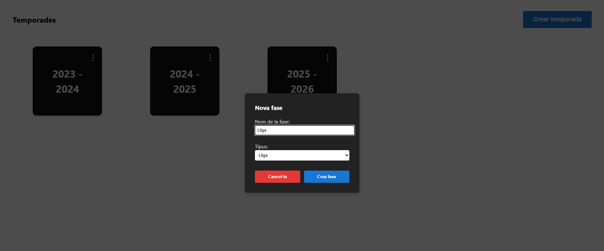
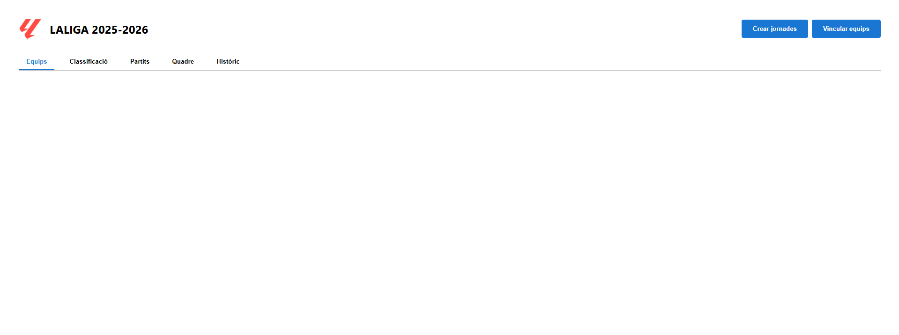
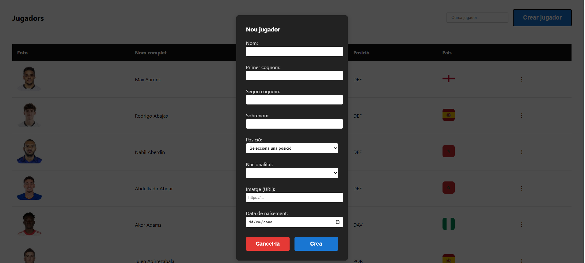
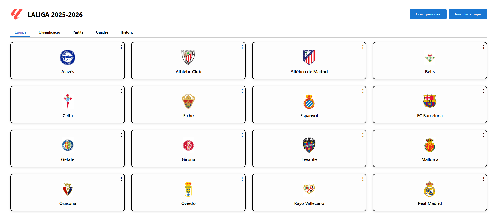
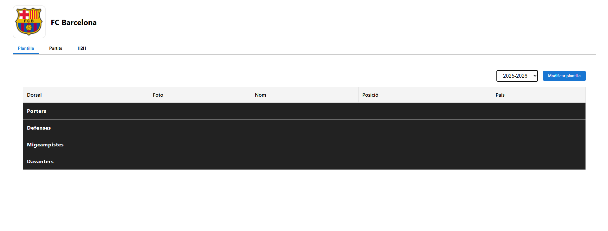

# Gestor de Resultados de LaLiga

## Índice

- [Introducción](#introducción)  
- [Tecnologías usadas](#tecnologías-usadas)  
- [Instalación](#instalación)  
  - [1. Clonar el repositorio](#1-clonar-el-repositorio)  
  - [2. Backend](#2-instalación-de-dependencias-del-backend)  
  - [3. Base de datos](#3-creación-de-la-base-de-datos)  
  - [4. Frontend](#4-instalación-de-paquetes-frontend)  
- [Ejecución](#ejecución)  
- [Funcionalidades y guía de uso](#funcionalidades-y-guía-de-uso)  
- [Futuras funcionalidades](#futuras-funcionalidades)   

---

## Introducción

Como amante del fútbol, siempre me ha fascinado cómo funcionan las aplicaciones de gestión de resultados.  
Este proyecto es una **aplicación web educativa** para gestionar competiciones de fútbol, resultados y clasificaciones, siguiendo los criterios de desempate de [LaLiga](https://www.laliga.com).

Con esta aplicación podrás:

- Crear competiciones, temporadas y partidos manualmente.
- Crear jugadores y asignarlos a equipos por temporada.
- Registrar resultados y actualizar la clasificación automáticamente.

---

## Tecnologías usadas

**Backend**
- [FastAPI](https://fastapi.tiangolo.com/) (Python 3.10+)  
- [MySQL](https://www.mysql.com/)  
- [Alembic](https://alembic.sqlalchemy.org/) para migraciones

**Frontend**
- [Vue.js](https://vuejs.org/)  
- [Node.js](https://nodejs.org/) / [npm](https://www.npmjs.com/)

---

## INSTALACIÓN

Para empezar a usar esta aplicación, necesitarás:

- MySQL como gestor de datos
- Python 3.10+ y pip
- Node.js y npm (para el frontend con Vue.js)

---

### 1. Clonar el repositorio

Clonar el repositorio via IDE, o via terminal:
```
git clone https://github.com/.../...(url del repositorio)
cd repo
```

### 2. Instalación de dependencias del Backend

```
cd backend
python -m venv venv
# Activar entorno
# En Linux/Mac:
source venv/bin/activate
# En Windows:
venv\Scripts\activate
```
**Instalar las dependencias**

```
pip install -r requirements.txt
```
**Configurar la conexión a MySQL**

Crea un archivo .env en la raíz del backend

```
MYSQL_HOST=localhost	
MYSQL_USER=your_user	
MYSQL_PASSWORD=your_password
MYSQL_DB=futbol_gestor
MYSQL_PORT=3306	
MYSQL_DB_TEST=futbol_gestor_test
```

### 3. Creación de la base de datos mediante Alembic

Ejecutar en terminal:

```
alembic upgrade head
```
Una vez se ha creado la base de datos y las migraciones ya podemos empezar a correr el backend

### 4. Instalación de paquetes Frontend

Abrir una nueva terminal y acceder a la raíz del frontend

```
cd frontend
npm install
```
Una vez se han instalado los pqauetes del proyecto, ya se puede correr el frontend.

## EJECUCIÓN

Para ejecutar el programa, una vez instaladas todas las dependencias y inicializada la base de datos hay que abrir dos terminales. En una, ir a la raíz del directorio backend y ejecutar
```
uvicorn app.main:app --reload
```
El backend corre en el puerto 8000.

En la otra terminal, ir a la raíz del directorio frontend y ejecutar

```
npm run dev
```
El frontend corre en el puerto 5173 por defecto, aunque para empezar a usar la aplicación, hay que acceder a http://localhost:5173/, o el puerto donde esté corriendo el frontend.

## FUNCIONALIDADES Y GUÍA DE USO

Funcionalidades disponibles:

- Crear equipos
- Crear competiciones tipo liga regular
- Crear temporadas de cada competición creada
- Vincular equipos a temporadas
- Crear jornadas con partidos
- Editar los resultados de los partidos
- Consultar la clasificación por jornada
- Consultar el historial de posiciones de cada equipo en la temporada
- Crear jugadores
- Vincular jugadores a los equipos de cada temporada

---
**Crear equipos**

Para crear un equipo, hay que ir a la vista /equips. Hay que pulsar el botón azul y en el menú introducir nombre, siglas, país y un enlace de una imagen con el escudo.



**Crear competiciones liga regular**

Para crear una competicion hay que ir a la pantalla principal de la aplicación


Cuando clicas el botón de "Crear competició", se abre un menú para la creación, en él, hay que indicar el nombre y el tipo (actualmente solo soporta el formato "Lliga") como campos obligatorios, y de manera opcional, el país de la competición y un link de una imagen del logo.

**Crear temporadas de cada competición creada**





Una vez tenemos una competición creada, podemos entrar en ellas. Si clicamos, se nos abrirá la vista de competiciones.

Para crear una temporada, tenemos que pulsar el botón azul, y indicar en el menú los años de prinicipio y final y el número de equipos. En añadir estos datos, en el siguiente menú hay que poner un nombre para la fase de la competición, que será del tipo Liga.




**Vincular equipos a temporadas**

Cuando entramos en una temporada veremos el siguiente menú:



Hay que pulsar el botón de "Vincular equips". Se abre un menú, con un desplegable de equipos. Ahí puedes elegir el equipo que quieras. El proceso deberá ser repetido tantas veces como equipos que formen la competición.

**Crear jornadas con partidos**

Des de la misma vista, para crear partidos hay que clicar el botón azul "Crear jornades". Cuando lo pulsamos, se abre un menú donde hay que indicar el equipo local, el visitante y la jornada. Este proceso no se puede llevar a cabo hasta que los equipos esten vinculados a la temporada.

**Editar resultados de los partidos**

Desde la vista anterior, en el tab de "Partits" mediante los botones nos podemos desplazar por las jornadas. Cuando estamos en la jornada deseado, pulsamos el botón "Editar resultats". Cuando lo hayamos pulsado, se abrirán los cuadros de edición en cada una de las cards de los partidos, donde pondremos el número de goles de cada equipo. Cuando hayamos acabado de editar los partidos de una misma jornada, podemos darle a "Finalitzar edició" para guardar los resultados.

**Consultar la clasificación y el histórico**

Dentro de la misma vista de Partidos, podemos navegar por las diferentes tabs.

**Crear jugadores**

Desde la vista /jugadors podemos crear jugadores. 

Si pulsamos el botón azul de "Crear jugador", se abre un menú en el cual tenemos que indicar de manera obligatoria el nombre, el primer apellido y la posición del jugador(POR = portero, DEF = defensa, MIG = centrocampista y DAV = delantero). De manera opcional, podemos indicar el segundo apellido, un apodo (si tiene), la nacionalidad, una url de una imagen y la fecha de nacimeinto.


**Vincular jugadores a equipos**



Des de la vista de una temporada específica, al clicar en uno de los equipos podemos añadir jugadores a ese equipo.

Cuando clicamos en el equipo, veremos una tabla. En esa vsta tenemos que elegir la temporada a modificar y darle al botón azul.



Cuando pulsamos el botón, se abrirá un modal en el cual podremos elegir uno o más juagadores mediante checkbox. Cuando queremos guardarlos, tenemos que ir al final del modal y pulsar el botón azul.

## FUTURAS FUNCIONALIDADES

Este proyecto está en una fase inicial. Aunque cubre las funcionalidades básicas, mi intención es mejorar la aplicación.

Las futuras funcionalidades que quiero añadir son:

- Soporte para partidos aplazados: a veces en la vida real, los partidos se aplazan o se adelantan a la jornada correspondiente. Hay que añadir una funcionalidad para poder editar la clasificación sin modificar las clasificaciones anteriores.

- Importación de plantillas: actualmente las plantillas se tienen que confeccionar a mano. Este proceso se puede hacer un poco costoso. De temporada a temporada en la vida real no suele haber muchos cambios en plantilla, así que mi intención es desarrollar una funcionalidad para importar la plantilla del año anterior y así poder modificar los pocos cambios, en vez de añadir los jugadores de uno a uno.

- Gestor de eventos dentro del partido: desarrollar una funcionalidad para poder registrar los eventos del partido como las alineaciones, cambios, goles, asistencias y tarjetas.